# 第 2.4 节 安装 FreeBSD——基于 VMware Workstation Pro

>**技巧**
>
>如果需要 **现成的** 预安装镜像（本书自制），请参看本章虚拟机预安装镜像一节。


## 视频教程

- [001-WIndows11 安装 VMware17](https://www.bilibili.com/video/BV1Qji2YLEgS)

## 镜像下载

>**提示**
>
>虚拟机也可以使用 FreeBSD 官方构建的[虚拟机镜像](https://download.freebsd.org/releases/VM-IMAGES/14.2-RELEASE/amd64/Latest/)，需要手动扩容，文件系统可选 UFS 与 ZFS。
>
>虚拟机一般使用 `FreeBSD-14.2-RELEASE-amd64-disc1.iso` 等类似文件名和后缀的镜像，但是，`FreeBSD-14.2-RELEASE-amd64-memstick.img` 也并非只能用于 U 盘刻录，虚拟机也是可以用的，使用方法参考第 31.2 节。


## 博通直链

>**技巧**
>
>**可以免注册登录**
>
>博通直链：<https://softwareupdate.vmware.com/cds/vmw-desktop/ws/>，`windows/core/` 下的 `VMware-workstation-XX.X.X-XXXXXXXX.exe.tar` 即是，解压缩即可。

### 参考文献

- [[经验] 上直链！！ VMWare Workstation Pro 免费给个人用了](https://hostloc.com/thread-1306968-1-1.html)

### 参考文献

- 中文：[Workstation 和 Fusion 对个人使用完全免费，企业许可转向订阅](https://blogs.vmware.com/china/2024/05/16/workstation-%E5%92%8C-fusion-%E5%AF%B9%E4%B8%AA%E4%BA%BA%E4%BD%BF%E7%94%A8%E5%AE%8C%E5%85%A8%E5%85%8D%E8%B4%B9%EF%BC%8C%E4%BC%81%E4%B8%9A%E8%AE%B8%E5%8F%AF%E8%BD%AC%E5%90%91%E8%AE%A2%E9%98%85/)

## 配置虚拟机


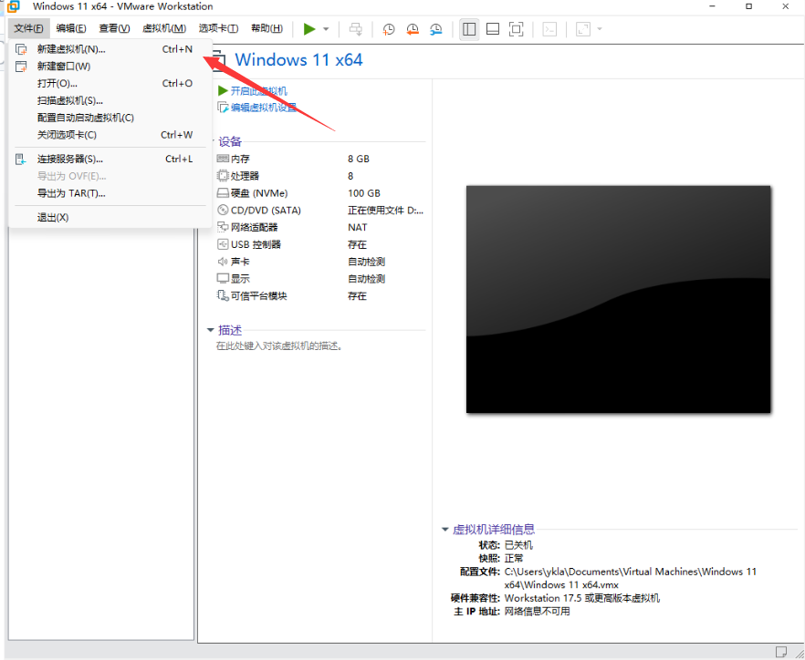


请务必选择“稍后安装操作系统”，否则启动会出问题。


请选择“其他”，然后选择 FreeBSD。

>**技巧**
>
>这一步其实无意义。甚至选择 Windows 也能顺利启动。但是对于低版本的 FreeBSD，虚拟机增强工具没有开源，可能会出问题。

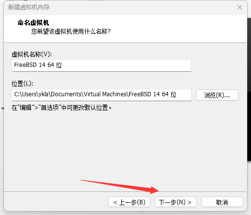

虚拟机占用磁盘空间极大。若你不想 C 盘被占满，请自行调整存储位置。


请调整最大磁盘大小。默认值不合理。若要安装桌面，最小要大于 20 G。


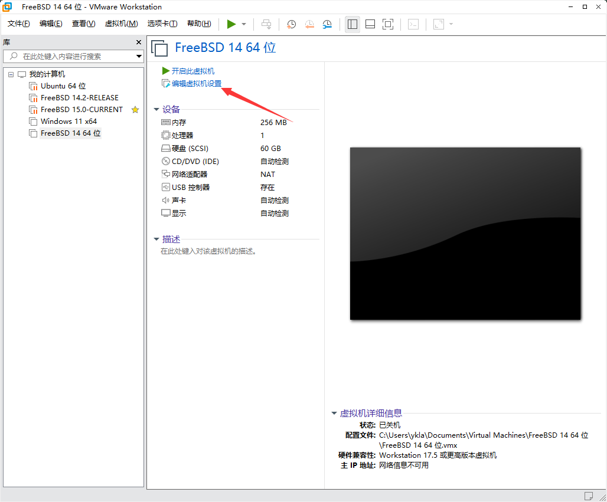

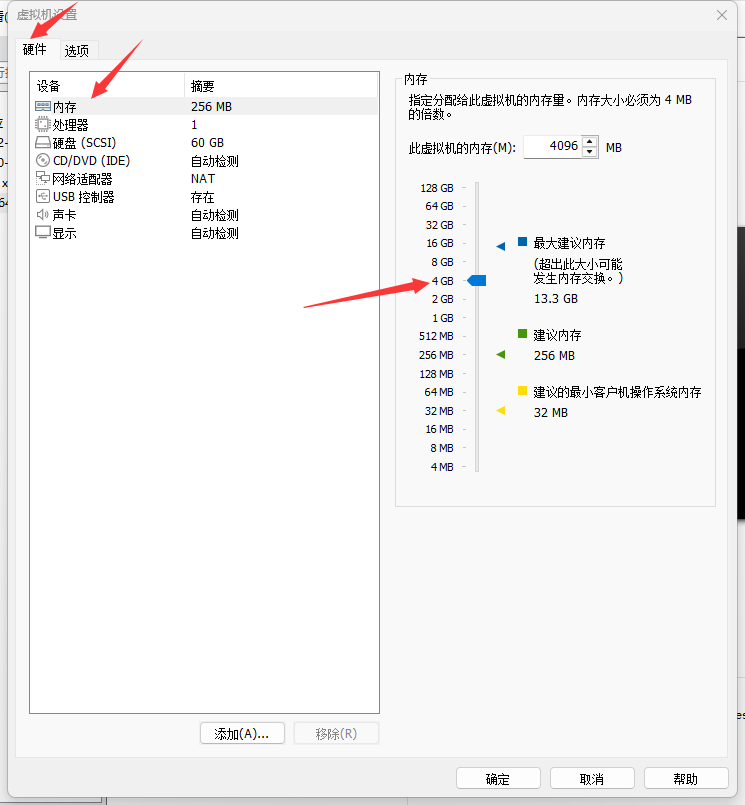

默认值 256 M 能够启动。但是不建议这么做。实在不行给 512 M 也行。


默认值 1 CPU 能够启动。但是不合理。


在“使用 ISO 映像文件”中，点击浏览找到，并选中你下载的 `-RELEASE-amd64-disc1.iso` 文件。

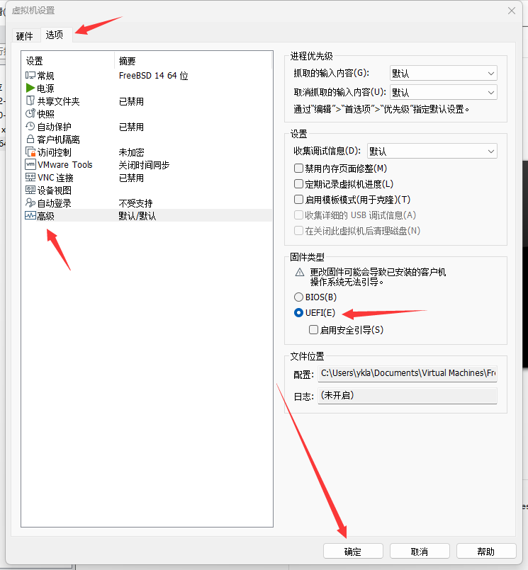


>**技巧**
>
> **BIOS 还是 UEFI**
>
> 经过测试，FreeBSD 也可以支持驱动 UEFI 下 VMware 的显卡。——2023.1.13
>
> 默认情况下 VMware 是 BIOS，会提示没有：
>
> ```sh
> # efibootmgr # 默认自带、无需安装。
> efibootmgr: efi variables not supported on this system. root? kldload efirt?
> ```
>
> 如果当前系统是 UEFI，efibootmgr 则输出：
>
> ```sh
> # efibootmgr # 默认自带、无需安装。
> Boot to FW : false
> BootCurrent: 0004
> BootOrder  : 0004, 0000, 0001, 0002, 0003
> +Boot0004* FreeBSD
> Boot0000* EFI VMware Virtual SCSI Hard Drive (0.0)
> Boot0001* EFI VMware Virtual IDE CDROM Drive (IDE 1:0)
> Boot0002* EFI Network
> Boot0003* EFI Internal Shell (Unsupported option)
> ```

> **警告**
>
> 由于 [Bug 250580 - VMware UEFI guests crash in virtual hardware after r366691](https://bugs.freebsd.org/bugzilla/show_bug.cgi?id=250580)，FreeBSD 11/12 在 VMware 的 UEFI 环境下可能无法启动。经测试 13.0 正常启动。


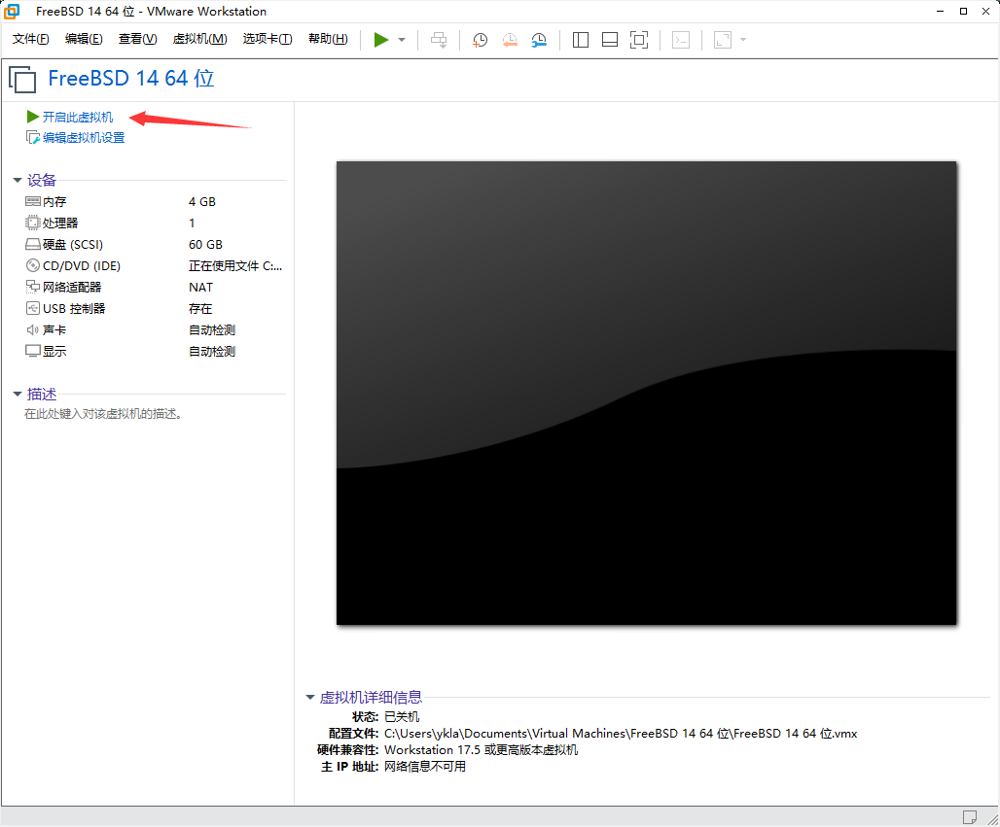


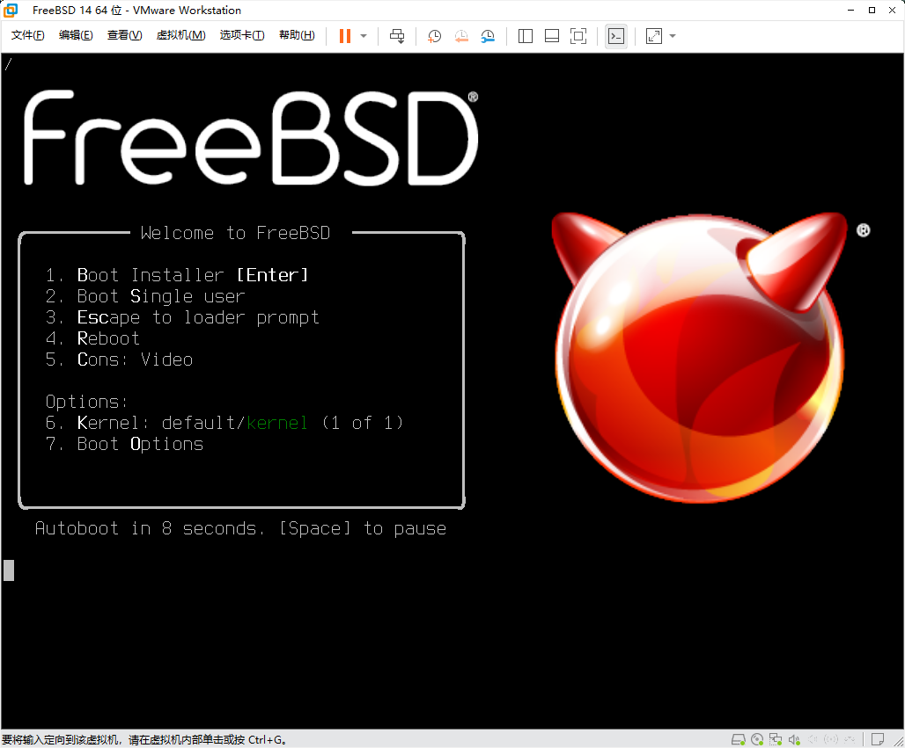


## 网络设置

请使用 NAT 模式（默认），如果不能与宿主机（物理机）互通，请打开 VMware 编辑-虚拟网络管理器，“还原默认设置”，直至出现类似下图的配置：

>**注意**
>
>经过测试，桥接的虚拟机在与主机传递文件时，网速极慢。

>**技巧**
>
>如果“还原默认设置”不起作用，始终只有单个某模式，请按照下图手动配置。

>**警告**
>
>NAT 模式“名称”是与你主机的 `控制面板\网络和 Internet\网络连接` 中的 `VMware Network Adapter VMnet8` 绑定的，默认绑定的是 `8`：换言之，`NAT 模式` “名称”默认必须指定为下图的 `VMnat8`，指定为其他名称虚拟机不会有网络！
>
>


以上请不要手动设置，如果虚拟机内部一直提示 `no link`，请重启物理机，再打开虚拟机：VMware 编辑-虚拟网络管理器，“还原默认设置”，直至出现上述配置。（请不要尝试手动配置，那是无效的）

如果没有网络请设置 DNS 为`223.5.5.5`。请看本章其余章节。


## 虚拟机增强工具与显卡驱动

安装显卡驱动和虚拟机增强工具，即：

```sh
# pkg install xf86-video-vmware open-vm-tools xf86-input-vmmouse open-vm-kmod
```

或者

```
# cd /usr/ports/x11-drivers/xf86-video-vmware/  && make install clean
# cd /usr/ports/emulators/open-vm-tools/ && make install clean
# cd /usr/ports/x11-drivers/xf86-input-vmmouse/  && make install clean
# cd /usr/ports/emulators/open-vm-kmod/ && make install clean
```

>**注意**
>
>若你不使用桌面还可以这样（仍然是 Port `emulators/open-vm-tools`）：
>
>```sh
># pkg install open-vm-tools-nox11
>```

安装完毕后无需任何多余配置即可实现屏幕自动缩放。

>**注意**
>
>wayland 下也需要安装该驱动。

>**技巧**
>
> 如果屏幕显示不正常（过大），请尝试：编辑虚拟机设置——>硬件、设备——>显示器——>监视器、指定监视器设置——>任意监视器的最大分辨率，设置为主机的分辨率或者略低于主机分辨率均可。


### 鼠标集成（主机虚拟机鼠标自由切换）

请先安装显卡驱动和虚拟机增强工具。

```sh
# sysrc moused_enable=YES
# Xorg -configure
# mv /root/xorg.conf.new /usr/local/share/X11/xorg.conf.d/xorg.conf
```

编辑 `/usr/local/share/X11/xorg.conf.d/xorg.conf` 修改以下段落为（其他部分不需要动，保留原样即可）：

```sh
Section "ServerLayout"
        Identifier     "X.org Configured"
        Screen          0  "Screen0" 0 0
        InputDevice    "Mouse0" "CorePointer"
        InputDevice    "Keyboard0" "CoreKeyboard"
        Option          "AutoAddDevices" "Off"  # 添加此行到此处
EndSection

…………此处省略一部分…………

Section "InputDevice"
      Identifier  "Mouse0"
      Driver      "vmmouse"  # 修改 mouse 为 vmmouse
      Option      "Protocol" "auto"
      Option      "Device" "/dev/sysmouse"
      Option      "ZAxisMapping" "4 5 6 7"
EndSection

…………此处省略一部分…………
```

### 共享文件夹

请先安装虚拟机增强工具。

#### 在物理机设置共享文件夹

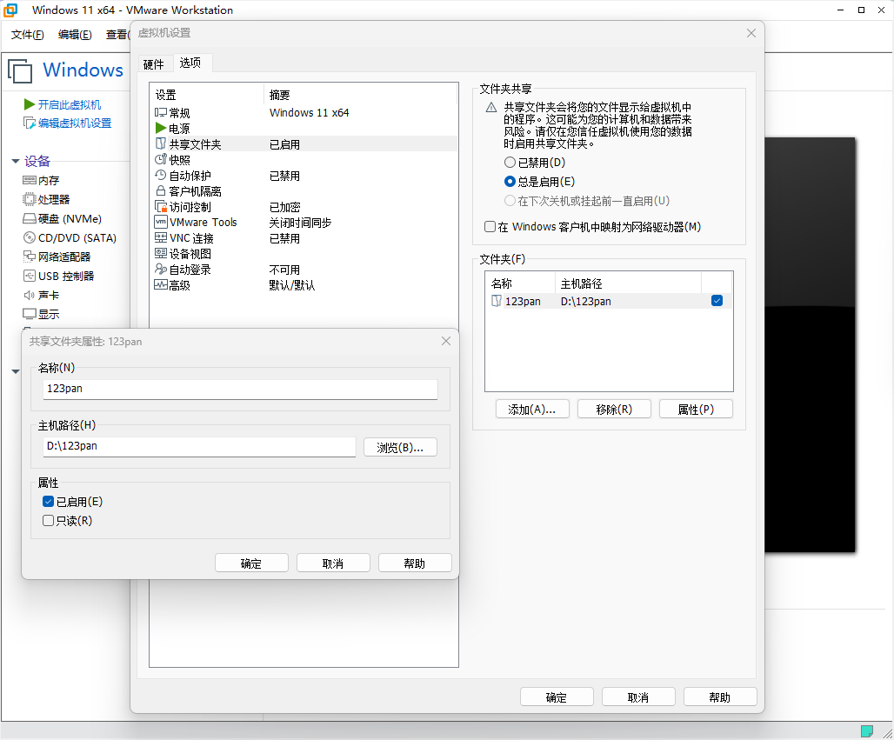

>**注意**
>
>不必疑惑虚拟机的名字是 Windows 11，因为这是 Windows11 和 BSD 双系统虚拟机。

在 FreeBSD 虚拟机中查看设置的文件夹：

```sh
root@ykla:/home/ykla # vmware-hgfsclient
123pan
```

#### 加载 fuse 模块

加载 fuse，将下文写入 `/boot/loader.conf`：

```sh
fusefs_load="YES"
```

#### 挂载

##### 手动挂载

>**注意**
>
>请将 `123pan` 换成你自己的路径。

```sh
# vmhgfs-fuse .host:/123pan /mnt/hgfs
```

##### 自动挂载

编辑 `/etc/fstab/`：写入：

>**注意**
>
>请将 `123pan` 换成你自己的路径。

```sh
.host:/123pan      /mnt/hgfs    fusefs  rw,mountprog=/usr/local/bin/vmhgfs-fuse,allow_other,failok 0
```

检查（请务必执行，否则若写错了会卡在开机处）：

```sh
# mount -al # 若无输出则正常
```

#### 查看共享文件夹

```sh
root@ykla:/home/ykla # ls /mnt/hgfs/
Downloads
root@ykla:/home/ykla # ls /mnt/hgfs/Downloads/
零跑
```


文件符合。

#### 参考文献

- [解决vmware上Ubuntu共享文件夹（2022年7月）](https://www.cnblogs.com/MaRcOGO/p/16463460.html)，整体方法参考此处
- [fuse: failed to open fuse device](https://forums.freebsd.org/threads/fuse-failed-to-open-fuse-device.44544/)，解决 `fuse: failed to open fuse device: No such file or directory` 的问题
- [VMware shared folders](https://forums.freebsd.org/threads/vmware-shared-folders.10318/)，挂载方法参考此处


## 故障排除

> **注意**
>
> 在使用 Windows 远程桌面或者其他 XRDP 工具远程另一台 Windows 桌面，并使用其上面运行的 VMware 虚拟机操作 FreeBSD 时，鼠标通常会变得难以控制。这是正常的！

- 每次进入图形界面，窗口都会异常扩大。

调整虚拟机的最大分辨率即可。

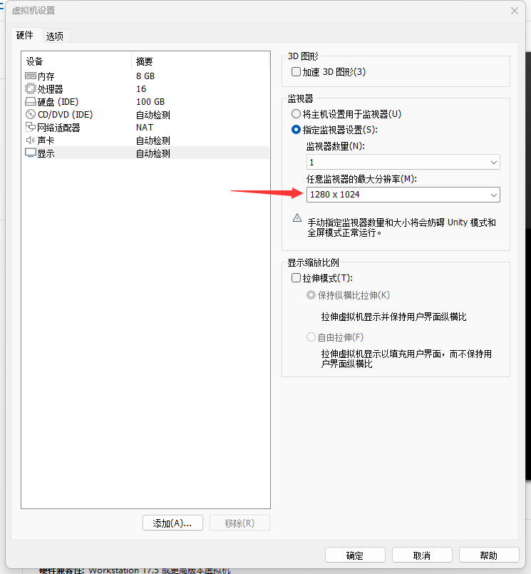

硬件——显示——监视器——任意监视器的最大分辨率(M)，将其由默认最大的 `2560 x 1600`（2K） 改成其他较小值即可，亦可自定义数值。

- 没有声音

加载声卡后若仍然没有声音，请将音量拉满到 100% 再看一下。因为默认声音几乎微不可闻。

- 只能按比例缩放，不能自由缩放拉抻

疑似 Bug，待解决

## 附录：博通（broadcom）账号相关

### 博通（broadcom）账号注册

VMware 已被博通收购。**故目前下载任何博通产品均须先注册、登录博通账号。** 目前任何非此域名（`broadcom.com`）教程均无效。

>**博通（broadcom）账号的注册流程**
>
>- 打开 <https://support.broadcom.com/>
>
> 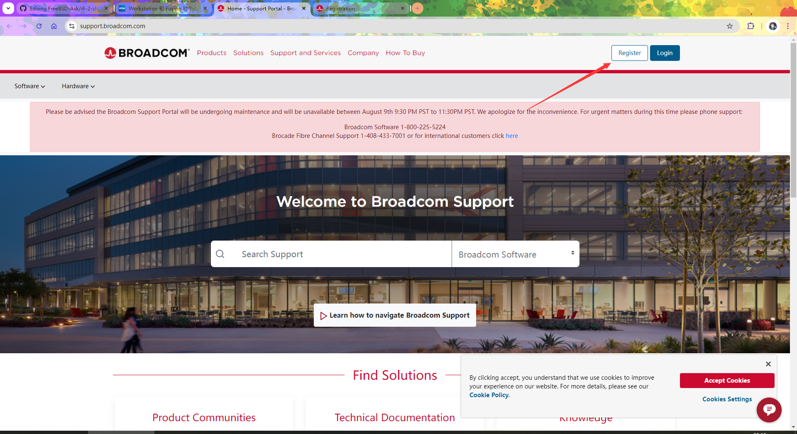
>
>- 点击右上角的“Register”（注册）（或者直接打开 <https://profile.broadcom.com/web/registration>）
>>
>>在页面“Email Address”（电子邮件）处输入你的电子邮箱。如果没有的话，可以用你的 QQ 号，然后直接加上一个`@qq.com`——比如你的 QQ 号是 `1212111111`，那么你的 QQ 邮箱则为 `1212111111@qq.com`
>>
>>在页面“Enter text from image”（输入图片上的文本）处输入图片上的文本信息（实际上是验证码）。如果看不清或者不认识，可以点 `Enter text from image` 右侧的🔁
>>点击“Next”（继续）
>>
>>如果你使用的是 QQ号生成的邮箱，请打开 <https://wx.mail.qq.com/>。其他邮箱请在各自网站打开，如果不知道，请使用 QQ 邮箱。
>
>
>
>- 把第五步得到的“Verification Code: 972980”，中的 972980（你的和我不一样，找你自己的）填到“Enter text from image” 里面。
>
>
>
>- 点击“Verify & Continue”（确认并继续）
>
>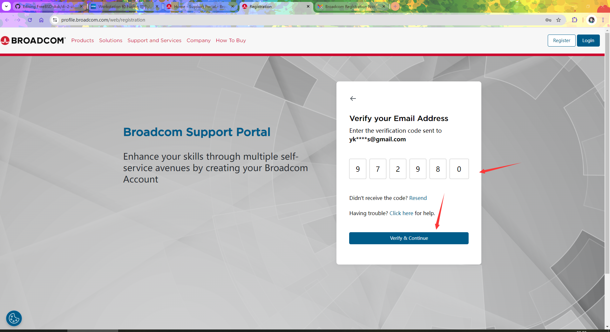
>
>- 完成注册
>
>
>
>- 结束注册流程
>  
>


### 博通（broadcom）账号登录

>**博通（broadcom）账号登录流程**
>
>- 打开 <https://support.broadcom.com/>
>>
>>点击右上角的“Login”（登录）（或者直接打开 <https://support.broadcom.com/c/portal/login>）
>
>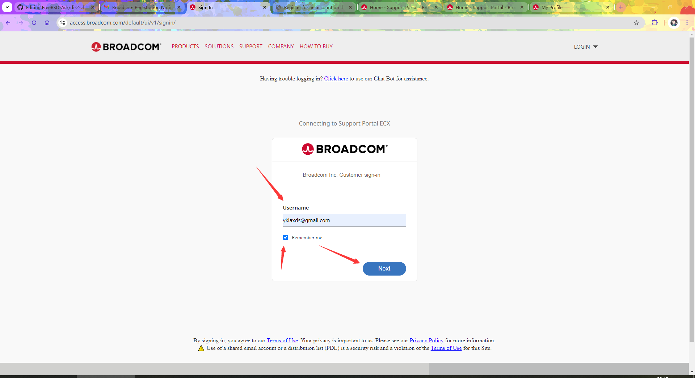
>
>- Username（用户名）就是你注册时候的邮箱。然后点“Next”（下一步）
>
>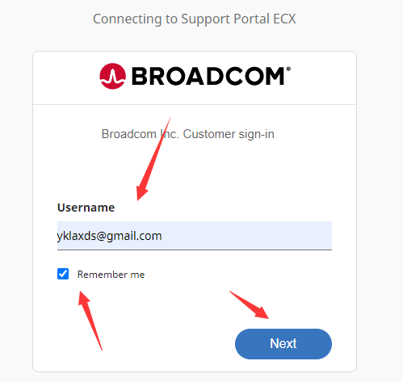
>
>- 点击下一步
>
>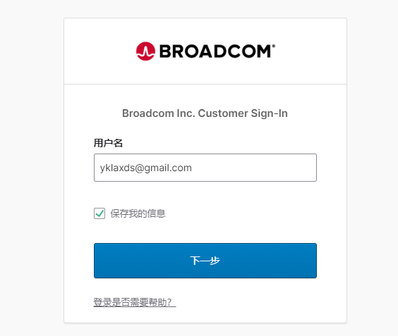
>
>- 点击登录
>
>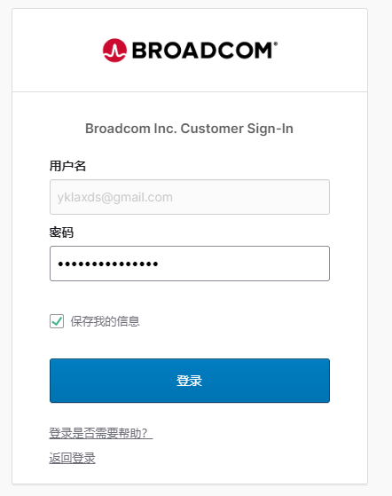
>
>- 登录完成
>
>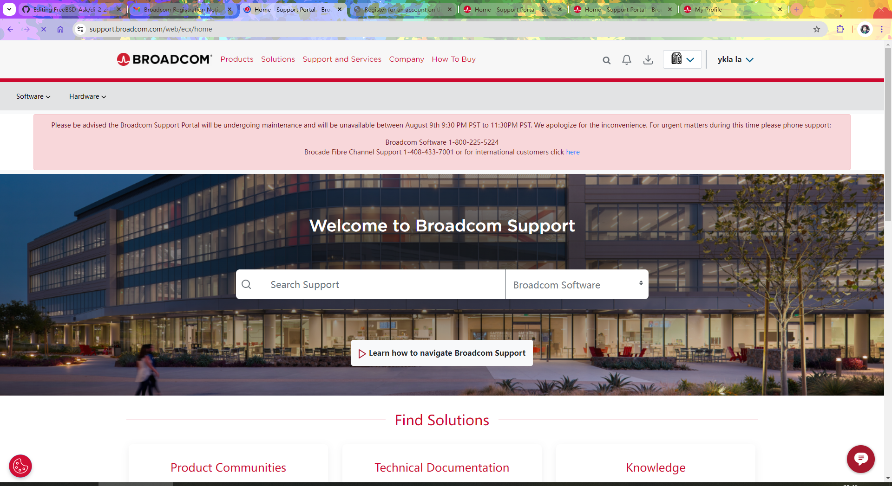

## 博通（broadcom）产品下载

### VMware Workstation Pro 下载（推荐）

>**VMware Workstation Pro 下载流程**
>
>- 点击右上角对应图标（名字左侧第一个），选择“VMware Cloud Foundation”（VMware 云计算基础架构）
>  
>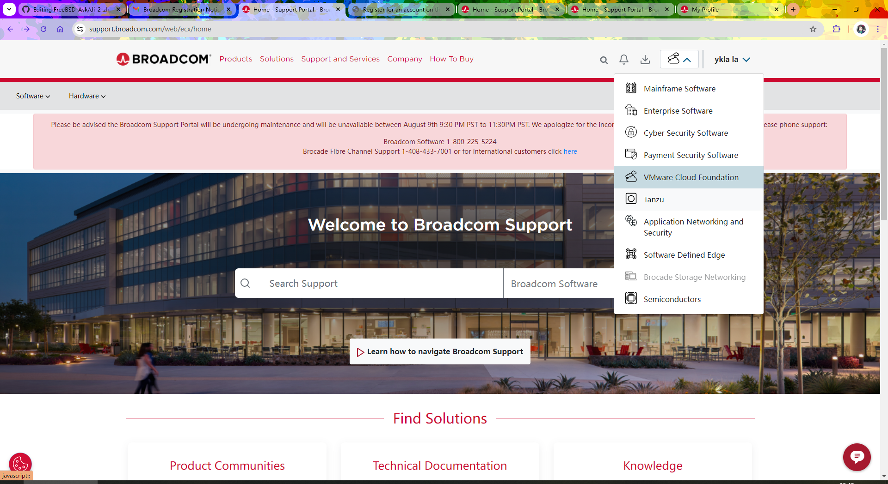
>
>- 点击右侧的“My Downloads”（我的下载）
>
>
>
>- 往下翻，点击“VMware Workstation Pro“
>
>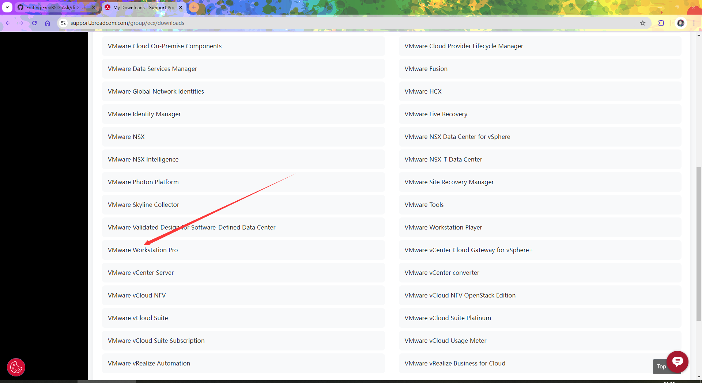
>
>- 点击“Release”（发行版），选择最顶部的那个，你看到的不一定和我一样。
>
>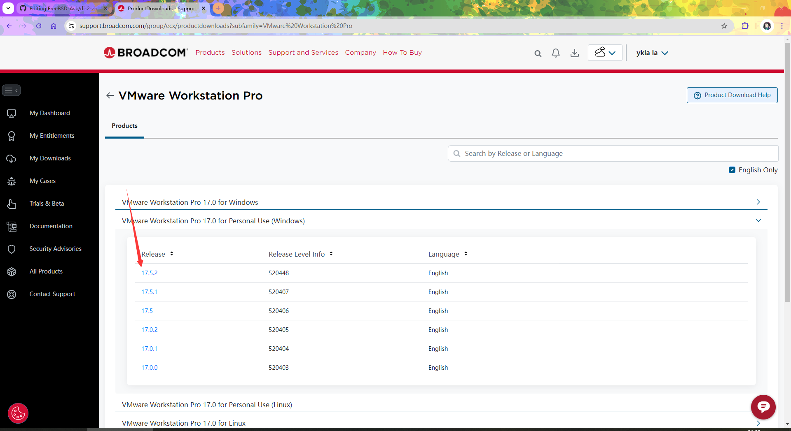
>
>**或者跳过上述步骤，直接打开 <https://support.broadcom.com/group/ecx/productdownloads?subfamily=VMware+Workstation+Pro>**
>
>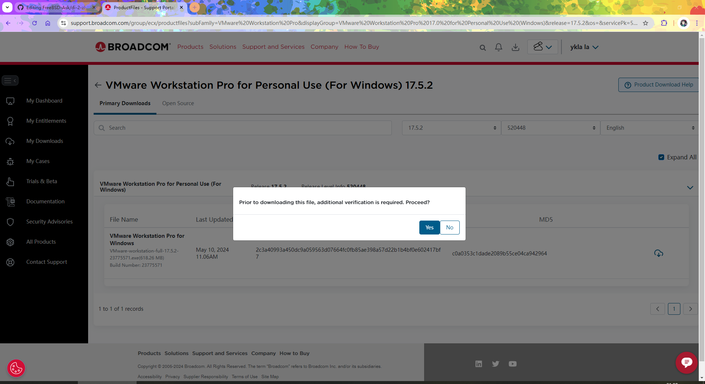
>
>- 把红色的 `*`项目填写完成，不会写的自己编，最好不要抄我的。
>  
>
>
>- 勾选“I agree to Terms and Conditions”（我同意条款及条件）左侧的方框 ⬜，让他变成 🟦。
>  
>
>
>- 点击右侧箭头的云朵图片 ☁️ 即可下载
>  
>


VMware Workstation Pro 目前对于个人用户来说是 **免费下载、免费使用、免费授权的。** **请勿从任何第三方站点下载。** 否则会造成一些未知的后果——90% 的问题都是由此产生的。


### 博通开源/社区产品

博通所有开源/社区产品都被整合到了这里进行下载。

如：Community Network Driver for ESXi、ESXi Arm Edition 等。

访问地址：<https://community.broadcom.com/flings/home>。目前任何非此域名教程（`community.broadcom.com`）均无效。

## VMware Workstation Player（已弃用，不要用）

VMware Workstation Player 目前已弃用。且功能相对 VMware Workstation Pro 非常有缺失。不建议使用，非要下载，请点击 <https://support.broadcom.com/group/ecx/productdownloads?subfamily=VMware%20Workstation%20Player>。目前所有包含该软件的教程均为旧教程。
